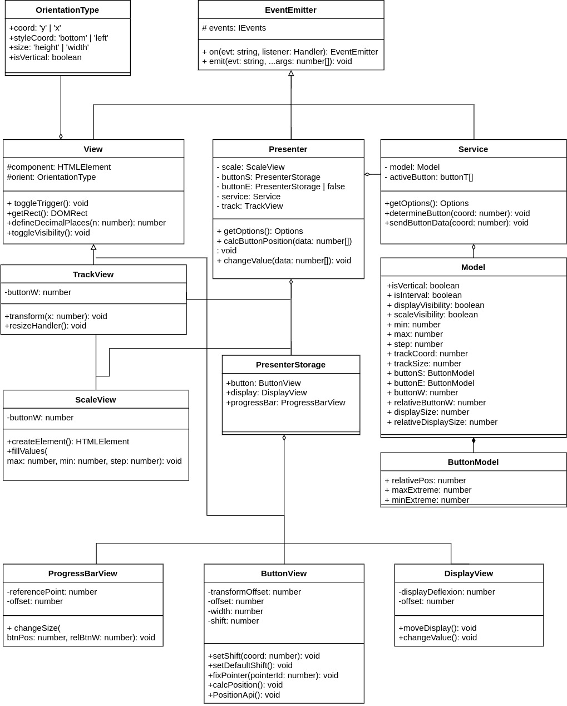

# Just a slider
## gh-pages
[example](https://gamabuntat.github.io/metalamp-4-step/)
## Запуск тестов
`npm test`
## Подключение
##### slider.js и slider.css лежат в docs

```htmL
<!DOCTYPE html>
<html lang="ru" class="html">
<head>
  <meta charset="UTF-8">
  <title>jquery slider</title>
  <link rel="stylesheet" href="slider.css">
  <script src="https://ajax.googleapis.com/ajax/libs/jquery/3.5.1/jquery.min.js"></script>
  <script src="slider.js"></script>
</head>
<script>
  $(function() {
    $('#slider').slider();
  });
</script>
<body>
  <div id="slider"></div>
</body>
```

## Опции
Базовый сладер имеет горизонтальную ориентацию и один бегунок.
Вот такие опции поддерживает слайдер:

    interval: boolean
    vertical: boolean
    displayVisibility: boolean
    scaleVisibility: boolean
    min: number
    max: number
    step: number

Например:

```javascript
// создает слайдер с двумя бегунками и со скрытыми тултипами,
// с максимальным значением шкалы равным 11
$(sliderID).slider({interval: true, scaleVisibility: false, max: 11})
```

## Методы

```javascript
// передвинет первый бегунок на позицию 10.12
$(sliderID).slider('option', 'move', 'buttonS', 10.12);
// передвинет второй бегунок на позицию 0.8
$(sliderID).slider('option', 'move', 'buttonE', 0.8);
// получить объект опций
$(sliderID).slider('option', 'get'); 
// скрыть\показать тултипы
$(sliderID).slider('option', 'toggleVisibility', 'display');
// скрыть\показать шкалу
$(sliderID).slider('option', 'toggleVisibility', 'scale');
```

## Архитектура
Плагин реализован по схеме MVP, с пассивным view.
Взаимодействие между слоями приложения реализовано с помощью класса EventEmitter. Presenter подписывается на события, которые вызывают Service и различные subViews.

## UML

